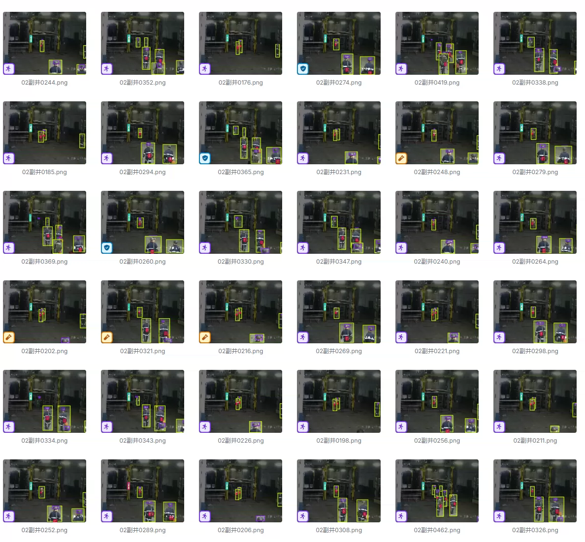
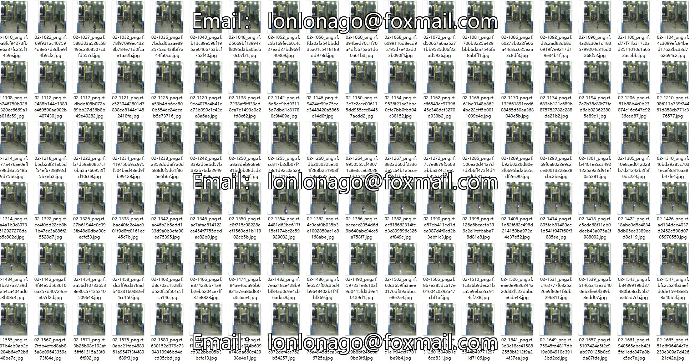
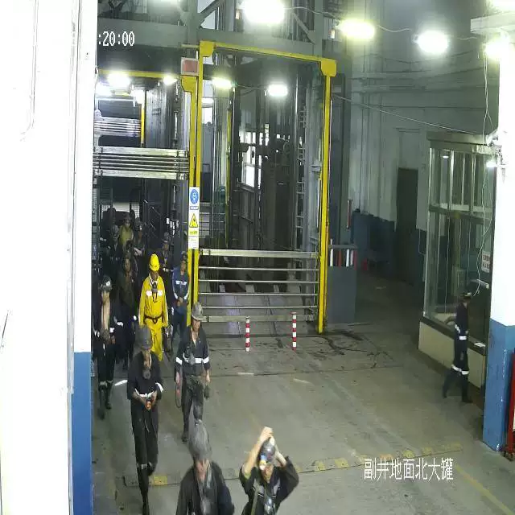
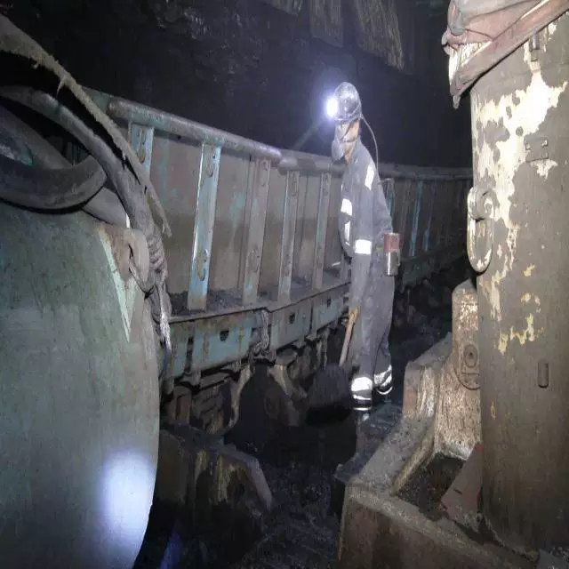

## Body

Mining and Mine Safety Person, Helmet, Indicator, Self-Rescuer Target Detection Dataset in YOLO format

Totally 4369 images, labeled with tags, and divided into training set, test set, validation set.

The dataset is divided into 4 categories: 'helmet', 'indicator', 'person', 'self-rescuer'
"Helmet", "Indicator", "Person", "Self-Rescuer"

## Images

Here is a pay link on Stripe ( https://buy.stripe.com/3cs8yP7sY87d0vu9AB ). Please contact me lonlonago@foxmail.com after funding $89, and I will send you a complete data files , thank you!

